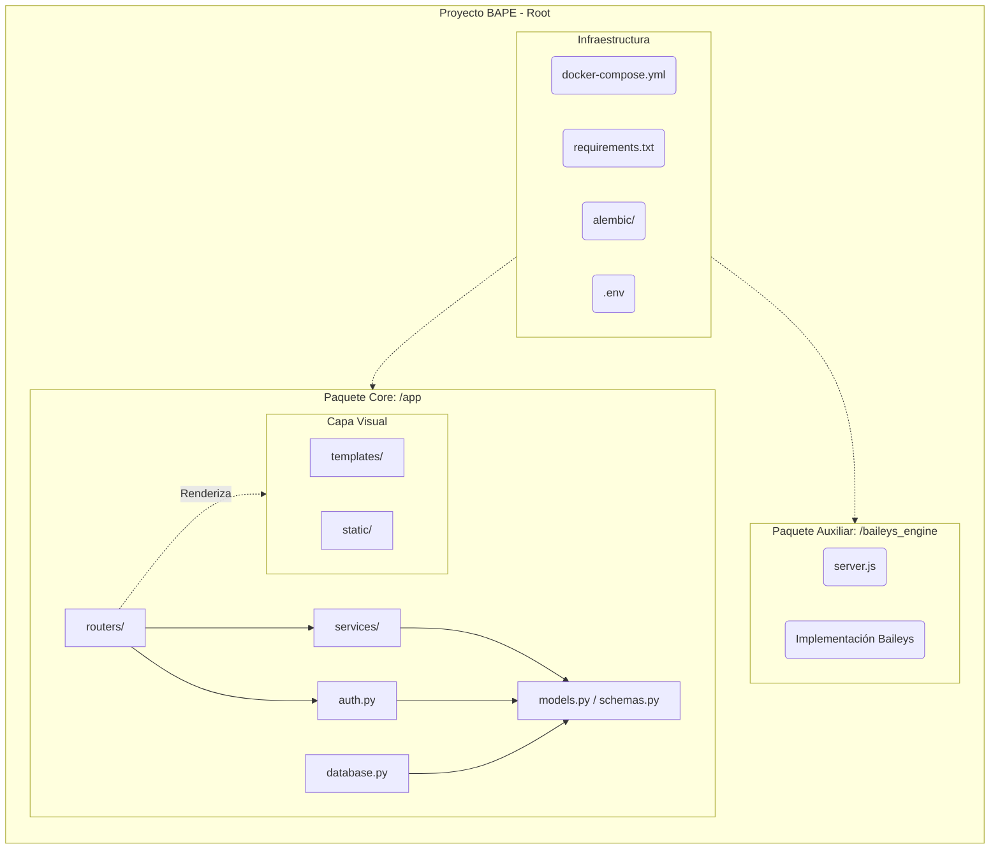
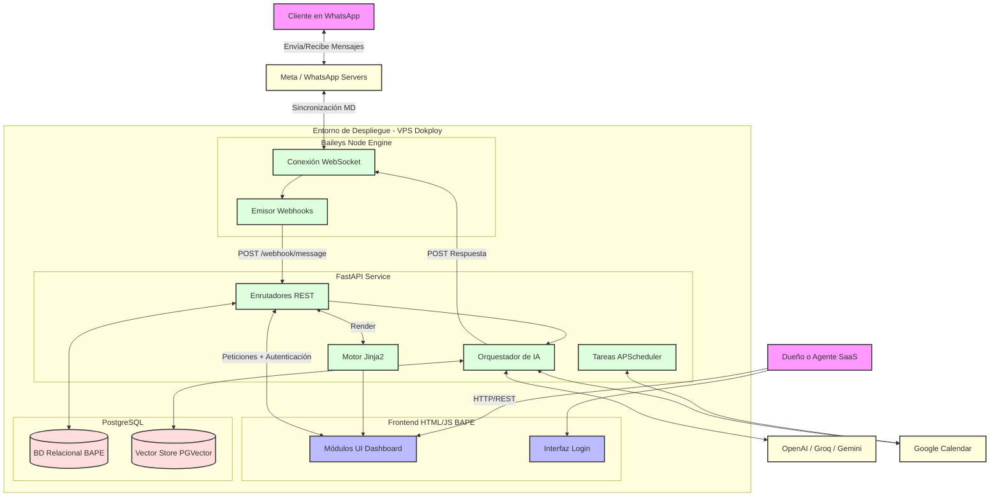
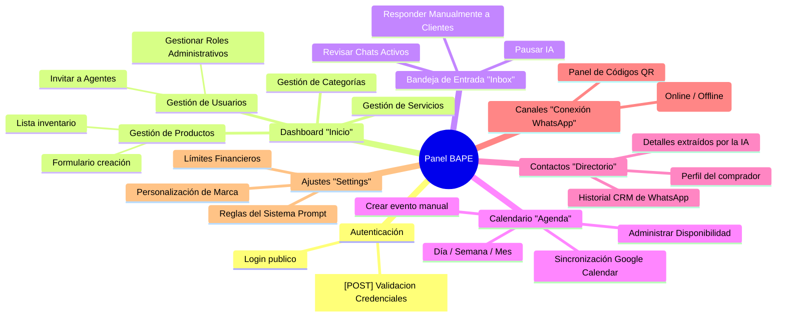

# DOCUMENTO DE ENTREGA: PROYECTO BAPE

Este documento detalla la arquitectura de software, la navegación del sistema y la pila tecnológica utilizada en el desarrollo y despliegue del proyecto BAPE (Bot Administrativo y de Planeación Empresarial).

---

## 1. Tecnologías y Frameworks Utilizados

El proyecto BAPE se construyó utilizando una arquitectura moderna orientada a microservicios, combinando Python para la lógica de negocio profunda y la IA, y Node.js para el manejo en tiempo real de WhatsApp.

### 🐍 Backend Principal (API)
*   **FastAPI**: Framework web principal, utilizado por su extrema rapidez y soporte nativo asíncrono.
*   **Uvicorn**: Servidor web ASGI para levantar la aplicación FastAPI.
*   **Jinja2**: Motor de plantillas (Template Engine) utilizado para renderizar las vistas dinámicas HTML del panel (Dashboard).
*   **APScheduler**: Utilizado de manera interna para programar y ejecutar tareas asíncronas en segundo plano (e.g., comprobación de citas de Google Calendar y envío de recordatorios automáticos).

### 🗄️ Base de Datos y ORM
*   **PostgreSQL 15**: Base de datos relacional principal, elegida por su solidez y capacidad de escalabilidad.
*   **pgvector**: Extensión de PostgreSQL que permite almacenar bases de datos vectoriales. Fundamental para almacenar los *embeddings* de los documentos de conocimiento del cliente, permitiendo que la IA busque respuestas precisas (RAG).
*   **SQLModel**: Orquestador ORM que combina SQLAlchemy y Pydantic, permitiendo declarar la estructura de las tablas y validar los datos que entran por la API simultáneamente.
*   **Alembic**: Herramienta de migraciones de base de datos para controlar el versionamiento de las tablas.

### 🧠 Inteligencia Artificial y Lógica Integrada
*   **OpenAI, Groq, y Google Gemini API**: Proveedores de Modelos de Lenguaje Grandes (LLMs). El sistema está programado para comunicarse dinámicamente con cualquiera de estos tres, basándose en la configuración de la empresa en el panel de `Settings`.
*   **FastEmbed**: Librería de Python para generar *embeddings* vectoriales de texto localmente de forma rápida sin costo en API externas.
*   **Google Calendar API**: Utilizada para la sincronización bidireccional y programación automática de citas gestionadas por la IA o los agentes.

### 🔐 Seguridad y Autenticación
*   **python-jose y passlib (bcrypt)**: Gestión de encriptación de contraseñas y emisión de tokens de seguridad JWT (JSON Web Tokens) para las sesiones de usuario.

### 📱 Motor de WhatsApp
*   **Node.js (v20)**: Entorno de ejecución seleccionado para el microservicio de WhatsApp debido a su superioridad en manejar websockets e hilos concurrentes.
*   **Baileys**: Librería estrella de Node.js que simula el protocolo de WhatsApp Web, permitiendo conectar números mediante código QR sin utilizar la API oficial paga de Meta.
*   **Express**: Framework ligero en Node.js que expone los endpoints internos para que FastAPI le envíe los mensajes generados por la Inteligencia Artificial.

### 🚀 Despliegue e Infraestructura (DevOps)
*   **Docker y Docker Compose**: Utilizados para empaquetar, aislar y orquestar los 3 contenedores del ecosistema (Base de Datos, Motor Node.js, API FastAPI).
*   **VPS (Hostinger)**: Servidor Privado Virtual para alojar la aplicación garantizando control sobre el hardware 24/7.
*   **Dokploy**: Plataforma como Servicio (PaaS) Open-Source instalada en el VPS. Se encarga de hacer Autodeploys cada vez que se envía o empuja nuevo código a la rama `master` en GitHub, compilando la nueva versión con Zero-Downtime.

---

## 2. Diagramas de Arquitectura

### 📦 Diagrama de Paquetes
Este diagrama expone de forma simplificada cómo está estructurado físicamente el repositorio y las responsabilidades de las carpetas internas en FastAPI.

### 🧩 Diagrama de Componentes
Este diagrama ilustra las piezas lógicas del servidor y el ciclo de vida o conexión entre ellas al procesar dinámicas del negocio.

---

## 3. Mapa de Navegación del Sitio (Sitemap UI)
Toda la interfaz del sistema web para la administración por parte del usuario y sus agentes (Frontend).

---
*Documento generado para la verificación técnica y de despliegue del proyecto BAPE.*
